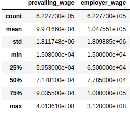
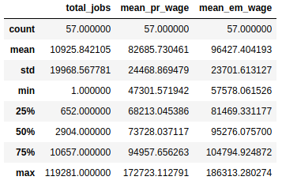
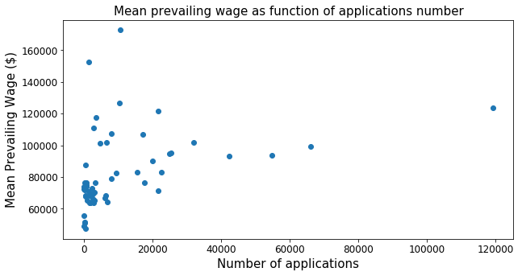
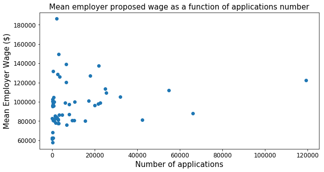

# Statistics Report

The data for this project, which is obtained 
from [H1B](https://www.foreignlaborcert.doleta.gov/pdf/PerformanceData/2017/H-1B_Disclosure_Data_FY17.xlsx) 
applications contains only three numerical variables after data wrangling. But of those three variables only two of them have a
useful value. Those variables are 'prevailing_wage' and 'employer_wage'. The variable 'prevailing_wage' is determined 
directly by the US Department of Labor from its [wage library](http://www.flcdatacenter.com/OesWizardStart.aspx). 
The variable 'employer_wage' is what an employer proposes as salary for whom the application is filed. Below is a summary on the statistics of these variables;.

In the present project,the purpose is to determine the salary a job applicant may expect to propose for salary negociation, so
the variable 'employer_wage' becomes the target for the model we are going to develop. Of course one of the possible independent variables to use then would be 'prevailing_wage'. For that purpose, the graph below shows a scatter plot of employer proposed wage against the prevailing wage.

From the plot, it doesn't seem to exist an obvious correlation between the prevailing wage and employer proposed wage. This is confirmed by the Pearson correlation between both variables which turns out to give just an 18.88% degree of correlation between both variables.

Not finding a strong correlation for the mentioned variables it becomes valid to explore how they behave with respect to the total number of applications per state. This question gave rise to a data set containing the total number of applications per state ('state_jobs'), the mean prevailing wage per state ('mean_pr_wage') and the mean employer proposed wage ('mean_em_wage').
Below is the summary statistics on that data set.

As the table above shows, there are extra 7 states and this needs to be corrected with further data wragling. However let's study like this if there is a correlation between the number of jobs applications per state and the mean wages per state.

