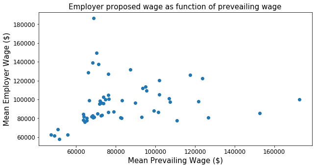
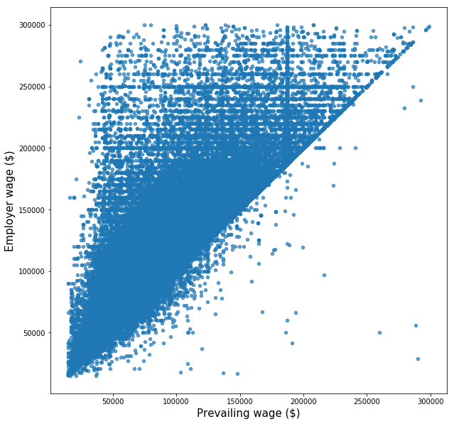

# Project 1 Milestone Report: 

## Problem:
When entering the job market for the first time or when transitioning to a new career path it is difficult to asses what the base salary for a given position should be. This problem is enhanced when we move to a new area or a different country given that salaries do not only depend on the field we have been trained but are also affected by the location where we are going to work. In order to help not only applicants but also employers it will be helpful to develop a model predicting the base salary a future employee should expect based on the data collected from US work visa applications.

## Possible Clients:
* Professionnals looking to migrate to the US or inside the US.
* Recruiters and HR departments.

## Data:
The data is obtained directly from the [United States Department of Labor (USDL)](https://www.foreignlaborcert.doleta.gov/performancedata.cfm) and can be downloaded from [here](https://www.foreignlaborcert.doleta.gov/pdf/PerformanceData/2017/H-1B_Disclosure_Data_FY17.xlsx). This data, pertaining to H-1B visa applications, which is a category for high-skilled workers, includes all the applications (even withdrawn ones) sent to USDL in 2017. The data set contains fields related to job position, work category, hiring company and its location, as well as prevailing wage and proposed salary per application among others.

## Data Wrangling:
The data being an excel file, it is loaded using Pandas’ ExcelFile() method and the sheet of interest is extracted into a Pandas data frame. The data set having several unnecessary columns for the project's goal, only the following columns were considered to create a clean data frame:
- EMPLOYER_NAME: Name of employer submitting labor condition application.
- JOB_TITLE: Title of the job.
- SOC_NAME: Occupational name associated with the SOC_CODE.
- FULL_TIME_POSITION: Y = Full Time Position; N = Part Time Position.
- PREVAILING_WAGE: Prevailing Wage for the job being requested for temporary labor condition.
- PW_UNIT_OF_PAY: Unit of Pay. Valid values include “Daily (DAI),” “Hourly (HR),” “Bi-weekly (BI),” “Weekly (WK),” “Monthly (MTH),” and “Yearly (YR)”.
- WAGE_RATE_OF_PAY_FROM: Employer’s proposed wage rate.
- WAGE_RATE_OF_PAY_TO: Maximum proposed wage rate.
- WAGE_UNIT_OF_PAY: Unit of pay. Valid values include “Hour", "Week", "Bi-Weekly", "Month",
or "Year".
- WORKSITE_CITY :City information of the foreign worker's intended area of employment.
- WORKSITE_COUNTY: County information of the foreign worker's intended area of employment.
- WORKSITE_STATE: State information of the foreign worker's intended area of employment.
- WORKSITE_POSTAL_CODE:  Zip Code information of the foreign worker's intended area of employment.

After this step only 0.21% of the data contained null entries. Given the size of the data set (more than 620K entries), for simplicity the rows with null values were eliminated. The model to develop having the purpose of calculating annual salaries, the entries PW_UNIT_OF_PAY, WAGE_UNIT_OF_PAY and FULL_TIME_POSITION were used to transform all entries from PREVAILING_WAGE and WAGE_RATE_OF_PAY_FROM to annual wages.

In the column 'WORKSITE_POSTAL_CODE' the postal codes came in several formats: five digits, ten digits, ten digits with a dash after the first five, and codes with other non-numerical characters. All the rows with a non five digits format are transformed to five digits format to reduce the number of categories in this column.

Finally the cleaned data set is saved for later use with the columns 'employer',	'job_title', 'occupational_name',	'prevailing_wage',	'pw_wage_period',	'employer_wage',	'employer_max_wage',	'employer_wage_period',	'city',	'county',	'state' and	'postal_code'.

## Approach:
The purpose of this project being to predict an expected salary based on historical data, supervised learning using regression algorithms is used. The location, job title, and prevailing wage are used as predictors in trying to assertain a target salary. To train the model, the data is divided in two: one set is used to predict prevailing wages as a function of location, job title and work category and the second set is used to predict the final target salary as a function of the predicted prevailing wage and the location of employment. Each of these subsets is divided in two in order to have training and testing data to develp the models.

For the first part, predicting the prevailing wage, except for 'prevaling_wage' and 'employer_wage', which are the target variables, all the other columns are categorical. Then the most straight forward approach is to concatenate per row the values of this columns into a single string keeping spaces between words. The resulting strings are encoded using a TF-IDF vectorizer that allows to rewrite them in a numerical form so they can be used for a numerical regression. Given the amount of the data and to avoid computer memory issues, the regression is done using an Stochastic Gradient Descent (SGD) regressor that allows to build a model by data batches.

For the second part, the model in the first part is used to predict prevailing wages. Finally with these prevailing wages and  using the columns 'state' and 'postal_code' the final model predicting salary is built. In this case, given not only the amount of data but also the high number of categories in 'postal_code' (more than 10K), we use also an SGD regressor to build the model.

## Initial Findings:
The figure below seems to indicate that the correlation between the state mean prevailing wage and the state mean employer proposed wage is low. This is confirmed by the Pearson correlation coefficient that has a value of 0.1888.

However if we consider the individual prevailing wages against the individual employer proposed wages, taking only salaries below $300K, the Pearson correlation is high (~0.8646) as the figure below suggests.

This figure also suggests that most of the salaries are higher than the local prevailing wages.
